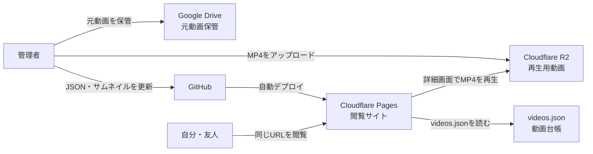
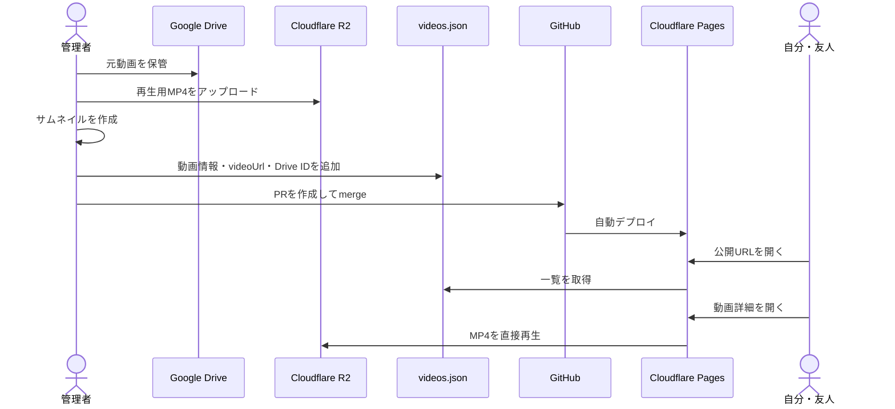

# Video Log 設計

## 1. 目的

自分と友人が同じ画面で旅行動画を見られる、軽量な静的サイトを作る。
更新は年2〜3回とし、管理画面、DB、ログイン、APIは持たない。

## 2. システム構成



| システム | 役割 |
| --- | --- |
| GitHub | HTML、CSS、JavaScript、JSON、サムネイルを管理 |
| Cloudflare Pages | 閲覧サイトを公開 |
| Cloudflare R2 | MP4をRange対応で配信し、ブラウザで直接再生 |
| Google Drive | 元動画の保管 |
| `videos.json` | 動画情報、新着日、場所タグを管理 |

Google Driveのiframe / preview埋め込みは使用しない。DBは使用しない。

## 3. 技術構成

- HTML / CSS / Vanilla JavaScript
- Cloudflare Pages
- Cloudflare R2 Standard
- Google Drive
- 静的な `videos.json`
- JPEG / WebPサムネイル

フレームワーク、パッケージ、Webフォント、サーバー処理は使用しない。

### ビジュアルテーマ

- Midnight / Cobaltを採用する。
- 背景は濃紺、アクセントはコバルトブルー、文字は青みのある白を使用する。
- ブランドアイコンは再生マークではなく `VL` モノグラムとする。
- 動画とサムネイルを主役にし、装飾色は見出しと操作要素へ限定する。

## 4. 画面構成

### TOP (`index.html`)

1. 全動画からランダムに選ぶ3本のサムネイルカルーセル
2. 新着3本

カルーセルと新着カードのサムネイルから動画詳細へ移動する。カルーセル直下とヘッダーナビから一覧へ移動できる。

カルーセル直下に「海外を中心に、旅先の景色と音を残す映像記録。」というコンセプトを短く表示する。

### 一覧 (`timeline.html`)

- 年代別の動画一覧
- 場所タグによる絞り込み

### 動画詳細 (`video.html?id=動画ID`)

- `<video controls playsinline preload="metadata">` によるR2上のMP4直接再生
- タイトル、公開日、説明、場所タグ
- プレイヤーのメニューまたは長押しメニューからMP4を保存
- 現在の動画を除くランダム3本を「次に見る」として常時表示し、再生終了時にその位置まで移動

音付き自動再生はスマートフォンブラウザで制限されるため使用しない。再生ボタンを押すと音ありで再生する。

## 5. 機能

| 機能 | 判定方法 |
| --- | --- |
| 新着 | `publishedAt` の降順 |
| カルーセル | ページ表示時に全動画から重複なしでランダム3本。5秒ごとの自動切り替えとスマホの左右スワイプに対応 |
| タグ絞り込み | 場所タグ1件 |

視聴数、人気ランキング、いいねは実装しない。必要になった時点でDBとAPIの導入を再検討する。

## 6. videos.json

```json
[
  {
    "id": "202603-hongkong",
    "title": "香港、光と熱気の街",
    "description": "2026年3月の香港旅行。",
    "publishedAt": "2026-03-01",
    "tags": ["香港"],
    "thumbnail": "images/thumbnails/202603-hongkong.jpg",
    "videoUrl": "https://PUBLIC_BUCKET_URL/videos/202603-hongkong.mp4",
    "driveFileId": "GOOGLE_DRIVE_FILE_ID",
    "sortOrder": 1
  }
]
```

- `id` は一意とし、公開後は変更しない。
- タグは場所を表す1件だけにする。
- `sortOrder` は小さいほどおすすめ上位とする。
- `videoUrl` はR2上の公開MP4 URLとし、再生に使用する。
- `driveFileId` は元動画の保管元を識別するために残す。

## 7. ディレクトリ構成

```text
/
├── README.md
├── index.html
├── timeline.html
├── video.html
├── data/
│   └── videos.json
├── images/
│   └── thumbnails/
├── css/
│   └── style.css
├── js/
│   ├── app.js
│   └── video.js
└── docs/
    └── design.md
```

ローカル動画を置く `media/` はGit管理しない。

## 8. 動画公開フロー



### 動画追加手順

1. MP4をGoogle Driveへ保管し、必要に応じて共有リンクを作る。
2. MP4をR2の `videos/` 以下へアップロードし、Content-Typeを `video/mp4` にする。
3. 再生用URLが `206 Partial Content`、`Content-Type: video/mp4`、`Accept-Ranges: bytes` を返すことを確認する。
4. サムネイルを `images/thumbnails/` に追加する。
5. `data/videos.json` にメタ情報、`videoUrl`、`driveFileId` を追加する。
6. `./scripts/check.sh` とローカル表示を確認する。
7. 作業ブランチをpushし、PR・CIを経由してmergeする。

Google DriveまたはR2へアップロードしただけではサイトに追加されない。`videos.json` とサムネイルの反映が必要である。

## 9. 軽量化

- TOPと一覧では動画を読み込まず、サムネイルだけを表示する。
- サムネイルは1280×720、1枚200KB以下を目安にする。
- 一覧画像は遅延読み込みする。
- 動画本体は詳細画面だけで読み込む。
- TOPで動画を自動再生しない。
- 詳細画面は `preload="metadata"` とし、動画全体を先読みしない。

## 10. 公開範囲

- R2の再生用MP4は公開URLからアクセスできる。
- Google Driveはダウンロードを提供する場合のみ「リンクを知っている全員が閲覧可」にする。
- 完全な非公開サイトではない。
- 公開後は同じCloudflare Pagesドメインを継続利用する。

R2はStandardストレージを使用する。保存量10GB-month、Class A 100万回、Class B 1,000万回の月間無料枠を目安に運用する。`r2.dev` は低トラフィック用途とし、アクセス増加時はカスタムドメインを検討する。

## 11. 現在の実装状況

実装済み:

- ランダム3本カルーセル
- TOPの新着3本
- 動画サムネイル
- 年代別一覧
- 場所タグ絞り込み
- 動画詳細
- R2上のMP4直接再生
- プレイヤーメニューからの動画保存
- GitHub・Cloudflare Pagesへの公開

未実装:

- R2カスタムドメイン

## 12. 次のステップ

1. スマートフォン表示と操作を継続確認する。
2. 動画追加時はR2無料枠の保存量と操作回数を確認する。
3. `r2.dev` の制限が問題になった場合はカスタムドメインへ移行する。

## 13. 将来拡張

- 動画別OGP
- R2カスタムドメインとキャッシュ設定
- 必要になった場合のみ視聴数計測やアクセス制限を追加
