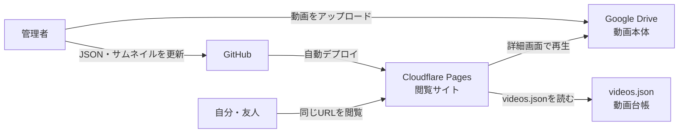
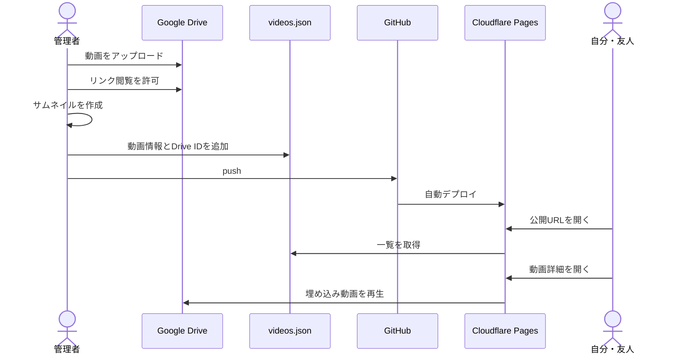

# Video Shelf 設計

## 1. 目的

自分と友人が同じ画面で旅行動画を見られる、軽量な静的サイトを作る。
更新は年2〜3回とし、管理画面、DB、ログイン、APIは持たない。

## 2. システム構成



| システム | 役割 |
| --- | --- |
| GitHub | HTML、CSS、JavaScript、JSON、サムネイルを管理 |
| Cloudflare Pages | 閲覧サイトを公開 |
| Google Drive | 動画本体を保存・再生 |
| `videos.json` | 動画情報、新着日、おすすめ順を管理 |

Google DriveはDBではなく動画ストレージである。DBは使用しない。

## 3. 技術構成

- HTML / CSS / Vanilla JavaScript
- Cloudflare Pages
- Google Drive
- 静的な `videos.json`
- JPEGサムネイル

フレームワーク、パッケージ、Webフォント、サーバー処理は使用しない。

## 4. 画面構成

### TOP (`index.html`)

1. おすすめ上位3本のサムネイルカルーセル
2. 新着3本
3. おすすめ3本
4. 全動画へのリンク

### 全動画

- 全動画一覧
- 新着順 / おすすめ順
- 場所タグによる絞り込み

初期版はTOP内に一覧を置く。動画が増えたら `videos.html` へ分離する。

### 動画詳細 (`video.html?id=動画ID`)

- Google Drive埋め込みプレーヤー
- タイトル、公開日、説明、場所タグ

## 5. 機能

| 機能 | 判定方法 |
| --- | --- |
| 新着 | `publishedAt` の降順 |
| おすすめ | `sortOrder` の昇順 |
| カルーセル | おすすめ上位3本 |
| タグ絞り込み | 場所タグ1件 |

視聴数、人気ランキング、いいねは実装しない。必要になった時点でDBとAPIの導入を再検討する。

## 6. videos.json

```json
[
  {
    "id": "202603-hongkong",
    "title": "香港、光と熱気の街",
    "description": "2026年3月の香港旅行。",
    "publishedAt": "2026-03-01",
    "tags": ["香港"],
    "thumbnail": "images/thumbnails/202603-hongkong.jpg",
    "driveFileId": "GOOGLE_DRIVE_FILE_ID",
    "sortOrder": 1
  }
]
```

- `id` は一意とし、公開後は変更しない。
- タグは場所を表す1件だけにする。
- `sortOrder` は小さいほどおすすめ上位とする。
- ローカル確認時のみ `driveFileId` の代わりに `src` を使用できる。

## 7. ディレクトリ構成

```text
/
├── README.md
├── index.html
├── video.html
├── data/
│   └── videos.json
├── images/
│   └── thumbnails/
├── css/
│   └── style.css
├── js/
│   ├── app.js
│   └── video.js
└── docs/
    └── design.md
```

ローカル動画を置く `media/` はGit管理しない。

## 8. 動画公開フロー



Google Driveへアップロードしただけではサイトに追加されない。`videos.json` とサムネイルをGitHubへ反映する必要がある。

## 9. 軽量化

- TOPと一覧では動画を読み込まず、サムネイルだけを表示する。
- サムネイルは1280×720、1枚200KB以下を目安にする。
- 一覧画像は遅延読み込みする。
- 動画本体は詳細画面だけで読み込む。
- TOPで動画を自動再生しない。

## 10. 公開範囲

- Google Driveは「リンクを知っている全員が閲覧可」にする。
- 完全な非公開サイトではない。
- 公開後は同じCloudflare Pagesドメインを継続利用する。

## 11. 現在の実装状況

実装済み:

- おすすめ3本カルーセル
- TOPの新着3本・おすすめ3本
- 動画サムネイル
- 全動画一覧
- 新着順 / おすすめ順
- 場所タグ絞り込み
- 動画詳細
- ローカル動画再生

未実装:

- Google Drive動画への切り替え
- GitHub・Cloudflare Pagesへの公開

## 12. 次のステップ

1. スマートフォン表示と操作を確認する。
2. Google Driveへ3本をアップロードする。
3. `src` を `driveFileId` に切り替えて再生確認する。
4. GitHubリポジトリを作成してpushする。
5. Cloudflare Pagesへ公開する。

## 13. 将来拡張

- 動画増加時の全動画ページ分離
- 動画別OGP
- Cloudflare R2への移行
- 必要になった場合のみ視聴数計測やアクセス制限を追加
